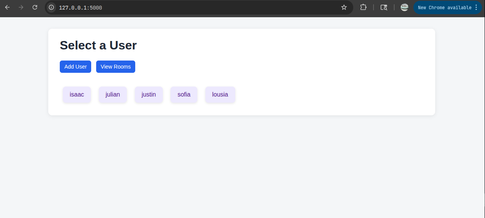
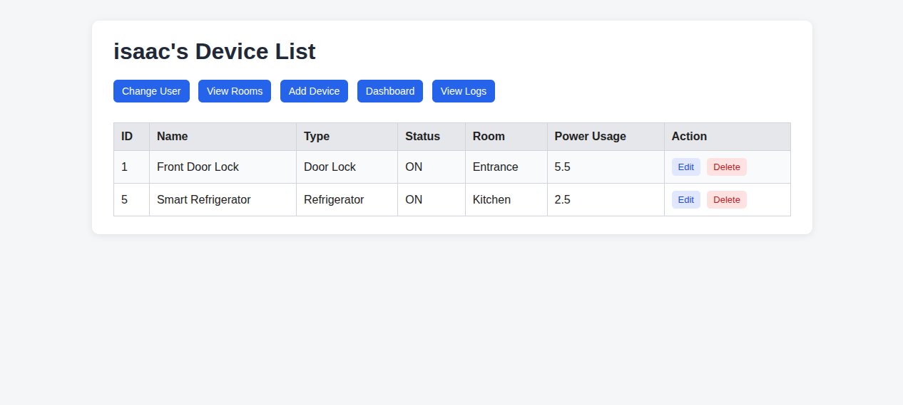
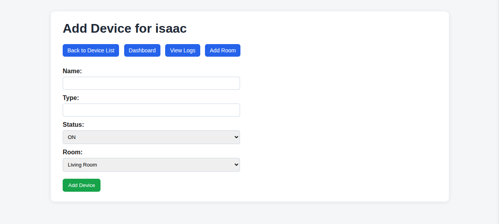
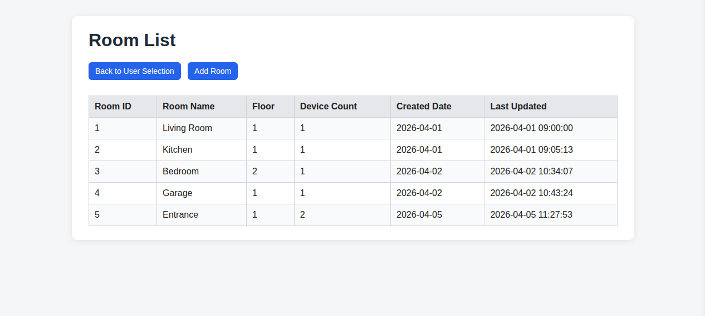
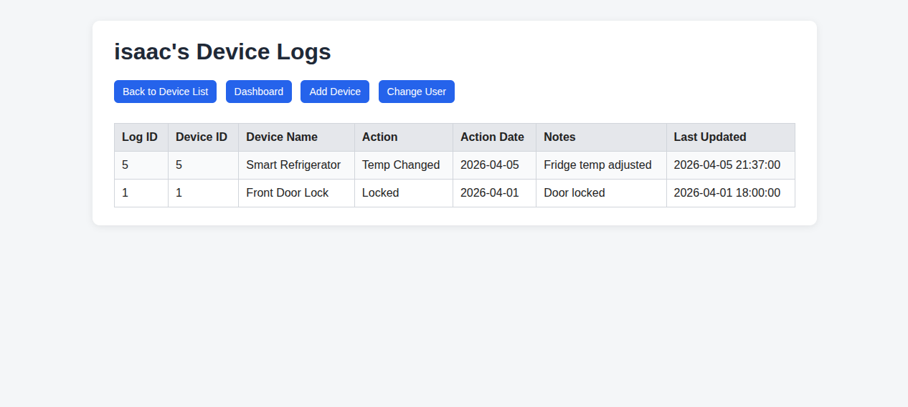
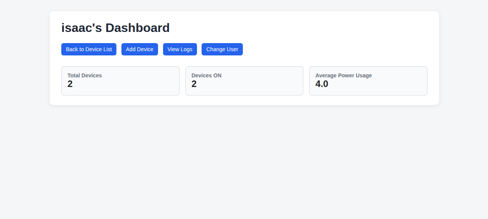
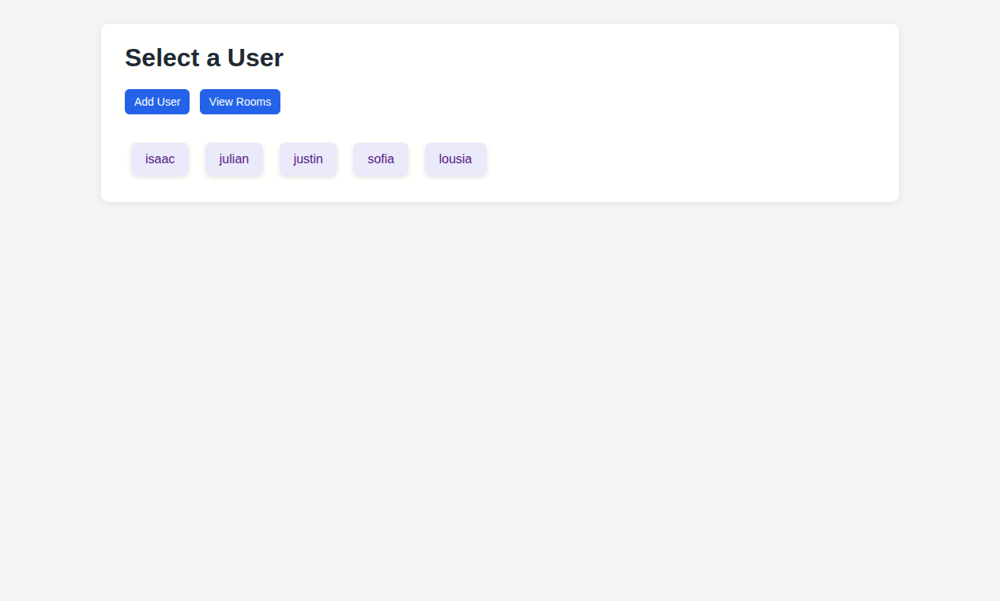

# Smart Home IoT Device Management App

## Project Description
This project is a full-stack Python web application for managing smart home devices.

The application allows users to select a profile and view only their own devices, similar to a user-based system. Each user can manage devices assigned to them, track device status, and view activity logs.

The app is designed for a simple smart home environment where users can:
- manage rooms
- manage devices
- track device activity logs
- view summary information about the system

The database design is based on four related tables:
- users
- rooms
- devices
- device_logs

---

## Features
- User selection interface (user-based device view)
- CRUD operations for devices
- User and room management
- Device activity log tracking
- Dashboard with aggregate statistics
- Relationship handling using foreign keys
- Transaction-based updates (device + log)
- Server-side validation

---

## Technical Stack
- SQLite
- Python3
- HTML/CSS
- Jinja2

---

## Usage

### 1. Start the Flask server
```bash
python3 app.py
```

### 2. Open the application
Go to the following address in your browser

http://127.0.0.1:5000

### 3. Basic Application Flow
1. Select a user




2. View that user's devices




3. Add, edit, or delete devices




4. View and manage rooms




5. View device logs




6. Check the dashboard for summary statistics




---

## Demo



---

## Installation Instructions

### 1. Clone the repository
```bash
git clone https://github.com/Moon035/database_project3.git
cd database_project3
```

### 2. Create and activate a virtual environment
```bash
python3 -m venv venv
source venv/bin/activate
```

### 3. Install dependencies
```bash
pip install -r requirements.txt
```

### 4. Set up the database
```bash
sqlite3 project3.db < schema.sql
```

